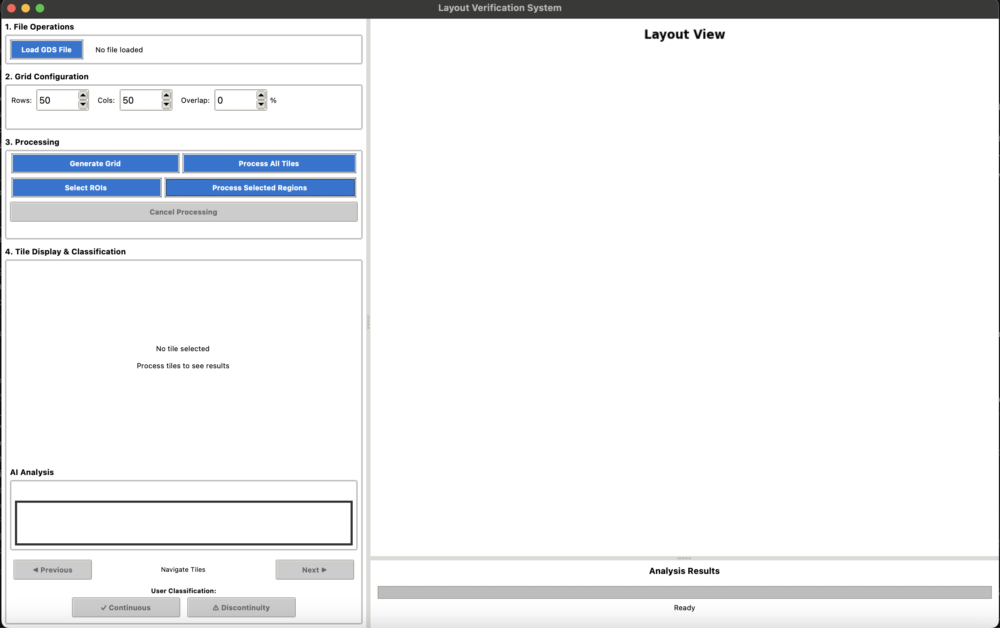

# AI Photonic Physical Verification

A comprehensive GUI application for automated photonic integrated circuit (PIC) layout verification using AI-powered discontinuity detection.

## 🚀 Features

### Core Functionality
- **GDS File Processing**: Load and analyze GDS layout files
- **SVG Conversion**: Automatic conversion from GDS to SVG format
- **Tile-Based Analysis**: Split large layouts into manageable tiles for detailed inspection
- **AI-Powered Detection**: Uses Google's Gemini models for intelligent discontinuity detection
- **Interactive Classification**: Manual review and classification of detected issues

### Advanced Capabilities
- **Virtual Tile System**: On-demand tile generation with intelligent caching
- **Region of Interest (ROI)**: Focus analysis on specific layout areas
- **Multi-threaded Processing**: Configurable CPU usage for optimal performance
- **Real-time Preview**: Interactive navigation with coordinate transformation
- **Comprehensive Export**: JSON export with complete analysis metadata

### User Interface
- **Dual-Panel Layout**: Controls on left, original layout visualization on right
- **Interactive Canvas**: Click navigation, ROI drawing with blue boxes, and colored tile status overlays
- **Visual Status Indicators**: Color-coded dots (🟢/🔴/🟠) showing AI classification results
- **Responsive Design**: Components scale proportionally with window resizing
- **Progress Tracking**: Real-time analysis progress with pause/resume capability
- **Enhanced Navigation**: Previous/Next buttons with keyboard shortcuts for tile review

## 📋 Requirements

### System Requirements
- **Python 3.8+** (Recommended: Python 3.9 or higher)
- **Operating System**: macOS, Linux, or Windows
- **Memory**: 4GB RAM minimum, 8GB+ recommended for large layouts
- **Storage**: 1GB free space for temporary files and caching

### API Requirements
- **Google API Key**: Required for AI analysis functionality
  - Get your key from [Google AI Studio](https://makersuite.google.com/app/apikey)

## 🛠 Installation

### ⚡ Quick Install (Recommended)

**One-command automated installation:**

```bash
# Clone repository
git clone https://github.com/nguyennm1024/ai-photonic-physical-verification.git
cd ai-photonic-physical-verification

# Run automated installer (macOS, Ubuntu/Debian, Fedora)
./install.sh

# Setup your Google API key
./setup_api_key.sh

# Start the application
python3 main.py
```

**That's it!** The script automatically installs:
- Python 3.11 and dependencies
- Tcl/Tk GUI libraries
- SVG converter (librsvg)
- All Python packages

### 📋 What You Need

1. **Operating System**: macOS, Ubuntu/Debian, or Fedora
2. **Google API Key**: Get FREE key from [Google AI Studio](https://makersuite.google.com/app/apikey)
3. **5-10 minutes** for installation

### 🔧 Manual Installation

If you prefer manual installation or use Windows:

```bash
# Clone and install
git clone https://github.com/nguyennm1024/ai-photonic-physical-verification.git
cd ai-photonic-physical-verification
pip install -e .

# Set API key
export GOOGLE_API_KEY='your_api_key_here'

# Install SVG converter
brew install librsvg  # macOS
# OR
sudo apt-get install librsvg2-bin  # Ubuntu/Debian

# Verify installation
python test_modules.py
```

**Guides:**
- **📖 First time?** See [QUICKSTART.md](QUICKSTART.md) (3 simple steps!)
- **🔧 Detailed setup:** See [INSTALLATION.md](INSTALLATION.md)
- **❓ Troubleshooting:** See [INSTALLATION.md#troubleshooting](INSTALLATION.md#troubleshooting)

## 🚀 Quick Start

### Basic Usage
```bash
python main.py
```

> **Note**: The old `layout_verification_app.py` has been renamed to `layout_verification_app_OLD.py`. Use `main.py` for the refactored version.

### Workflow
1. **Load GDS File**: Click "Load GDS File" and select your layout file
2. **Configure Grid**: Set tile grid size (default 50×50), overlap (default 0%)
3. **Generate Grid**: Click "Generate Grid" to prepare the tile system
4. **Select Region (Optional)**:
   - Click "Select ROIs" to enable ROI mode (button turns to "✓ Selecting ROIs")
   - Draw blue boxes on the layout to select specific regions
   - Select multiple regions without re-clicking the button
5. **Start AI Analysis**:
   - Click "Process All Tiles" for full layout analysis
   - Or "Process Selected Regions" for ROI-only analysis
6. **Review Results**:
   - View colored tile overlays on layout (green/red boxes)
   - Click any tile to see details in the review panel
   - Status indicators show 🟢 Continuity, 🔴 Discontinuity, or 🟠 No waveguide
   - Use Previous/Next buttons to navigate through tiles
7. **Manual Classification**: Classify tiles as "✓ Continuous" or "⚠ Discontinuity"
8. **Export Results**: Save analysis results to JSON format

**Tips:**
- Use ROI selection for focused analysis of critical areas
- Click "Cancel Processing" to pause at any time
- Resize window to adjust UI layout proportionally

## 📖 Documentation

### Application Architecture

**Modular Structure:**
- **`core/`** - Business logic (file management, tile system, AI analyzer, ROI manager, state)
- **`utils/`** - Coordinate transformations, image processing, thread-safe communication
- **`ui/`** - Reusable components, event handlers, styling

### UI Example



*The clean interface showing the dual-panel layout with controls on the left and interactive layout visualization on the right.*

### Guides
- **[INSTALLATION.md](INSTALLATION.md)** - Complete installation guide with troubleshooting
- **[docs/REFACTORING_DESIGN.md](docs/REFACTORING_DESIGN.md)** - Architecture & design details

## 🤖 AI Analysis

**Dual Model Architecture:**
- **Gemini Pro** for detailed analysis and reasoning
- **Gemini Flash** for fast three-category classification

**Analysis Pipeline:**
1. **Tile Generation**: Create analysis-ready image tiles with resolution-aware caching
2. **AI Processing**: Send tiles to Gemini Pro for detailed analysis
3. **Classification**: Three-category classification using Gemini Flash:
   - **Continuity** - Waveguides are continuous and properly aligned
   - **Discontinuity** - Breaks, gaps, misalignments, or structural issues detected
   - **No Waveguide** - No actual waveguides found in the tile
4. **Visual Feedback**: Colored overlays on layout and status indicators in review panel
5. **Result Storage**: Store detailed analysis, classification, and coordinates
6. **User Review**: Manual verification and correction with Previous/Next navigation

## 🔧 Troubleshooting

**Common Issues:**
- **Installation errors** → See [INSTALLATION.md](INSTALLATION.md#troubleshooting)
- **Tile generation fails** → Install rsvg-convert or inkscape
- **Memory issues** → Reduce grid size, use virtual tiles
- **Analysis errors** → Check API key configuration

## 📊 Example Usage

### Analyzing a Small Layout
```python
# Configuration for quick analysis
Grid Size: 10×10
Tile Resolution: 512px (AI), 384px (preview)
CPU Cores: 4
Virtual Tiles: Enabled
ROI Analysis: Optional - select specific areas
```

### Analyzing a Medium Layout (Default)
```python
# Default configuration - optimal for most cases
Grid Size: 50×50
Tile Overlap: 0%
Tile Resolution: 512px (AI), 384px (preview)
CPU Cores: 8
Cache Size: 100 tiles
Virtual Tiles: Enabled
```

### Analyzing a Large Layout
```python
# Configuration for comprehensive analysis
Grid Size: 80×80
Tile Resolution: 1024px
CPU Cores: 8
Virtual Tiles: Enabled
ROI Analysis: Highly recommended - focus on critical areas first
Preview Resolution: 384px for faster navigation
```

## 🤝 Contributing

We welcome contributions! Here are some areas where you can help:
- **Performance optimization** for large layouts
- **Additional AI models** integration
- **Export format** extensions
- **UI/UX improvements**
- **Documentation** enhancements

### Development Setup
1. Fork the repository and create a feature branch
2. Follow [INSTALLATION.md](INSTALLATION.md) for setup
3. Review [docs/REFACTORING_DESIGN.md](docs/REFACTORING_DESIGN.md) for architecture
4. Make your changes with tests
5. Submit a pull request

## 📄 License

This project is open source. Please see the license file for details.

## 🔗 Links

- [GitHub Repository](https://github.com/nguyennm1024/ai-photonic-physical-verification)
- [Google AI Studio - Get API Key](https://makersuite.google.com/app/apikey)
- [Report Issues](https://github.com/nguyennm1024/ai-photonic-physical-verification/issues)

## 📈 Project Status

**Current Version**: 2.1.0
**Status**: Active Development
**Last Updated**: October 2025

### Recent Updates

**v2.1 (October 2025) - UI/UX Enhancements:**
- Visual status indicators (🟢/🔴/🟠), responsive design, enhanced ROI selection
- Accurate coordinate transformation, resolution-aware caching
- Three-category classification, updated defaults (50×50 grid)

**v2.0 (October 2025) - Major Refactoring:**
- Modular architecture with 24+ modules, comprehensive testing
- Validated with real 4.5MB GDS files

**v1.0 (August 2025) - Initial Release:**
- Complete GUI with AI-powered discontinuity detection
